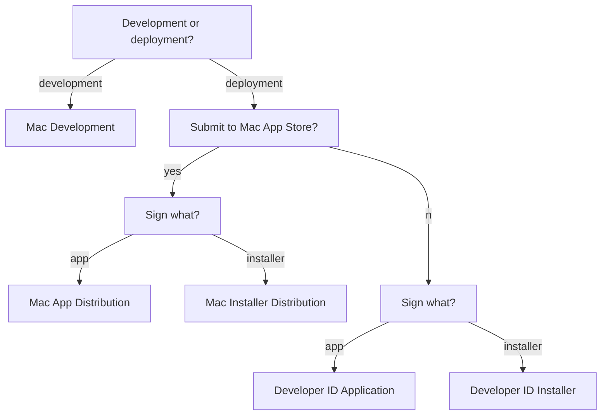

With the public release of macOS 10.14.5, all developers creating a Developer ID certificate for the first time are required to notarize their apps.

<!--more-->

<i class="fa fa-external-link" aria-hidden="true"></i> [New Notarization Requirements](https://developer.apple.com/news/?id=04102019a)

---

### What is notarization?

The Apple notary service is an automated system that scans software for malicious content. 

<i class="fa fa-external-link" aria-hidden="true"></i> [Notarizing Your App Before Distribution](https://developer.apple.com/documentation/security/notarizing_your_app_before_distribution?language=objc)

### Why do we need notarization?

Prior to notarization, [Gatekeeper](https://support.apple.com/en-us/HT202491) checked the source of a downloaded app (either the App Store, a registered developer, or an unidentified developer) and acted as a bouncer to allow or reject their launch. By default, security and privacy preferences are set to allow apps from the App Store and identified developers only. The setting can be further tightened to allow apps downloaded from the App Store only.

macOS 10.12 Sierra removed the option to allow apps from an unidentified developer (signed with a Mac Development certificate, which is available with a free Apple Developer ID for testing, or not signed at all). 

As of 10.14.5, this change can be overridden with the following code:

```
sudo spctl --master-disable
```  

A more prudent way, of course, would be to manage such apps would be to let Gatekeeper report them first and grant permission on a case-by-case basis.

### Select the appropriate type of certificate

Certificates are used to sign an application. Certificates can be created <i class="fa fa-external-link" aria-hidden="true"></i>[online](https://developer.apple.com/account), or from <i class="fa fa-external-link" aria-hidden="true"></i>[Xcode](https://help.apple.com/xcode/mac/current/#/dev154b28f09).

Apple recommends <i class="fa fa-external-link" aria-hidden="true"></i>[automatic signing](https://help.apple.com/xcode/mac/current/#/dev80cc24546) by Xcode. For an app built with 4D, most of the work must be performed manually, that is, using command line tools.

For instance, we can use Xcode to <i class="fa fa-external-link" aria-hidden="true"></i>[create a certificate](https://help.apple.com/xcode/mac/current/#/dev154b28f09?sub=dev23755c6c6), but we need to specify the appropriate type of certificate to create.

Apart from "iOS Development" and "iOS Distribution" which are obviously not for 4D, there are 5 different certificates types to choose from:

- Mac Development (Mac Developer)
- Mac App Distribution (3rd Party Mac Developer Application)
- Mac Installer Distribution (3rd Party Mac Developer Installer)
- Developer ID Application
- Developer ID Installer

A new "Apple Development" certificate is available in Xcode 11.0 and later, replacing "iOS Development" and "Mac Development". Likewise, "Apple Distribution" corresponds to "iOS Distribution" and "Mac App Distribution".
{:.info}

"Mac Development" is a certificate used during development, to sign an app that needs permission to use an app service or technology. 4D does not use any of the [advanced app capabilities](https://developer.apple.com/support/app-capabilities/) offered by Apple, but notarization checks for the [entitlements](https://developer.apple.com/documentation/bundleresources/entitlements?language=objc) related to the "Hardened Runtime" service. A 4D app may be signed using this type of certificate for testing.

"Mac App Distribution" is a certificate used to sign the app before distribution through the Mac App Store. Most 4D apps are not distributed through the store, so we can rule this one out.

"Mac Installer Distribution" is a certificate used to sign an installer package containing an app sign using a "Mac App Distribution" certificate, for distribution through the Mac App Store. Most 4D apps are not distributed through the store, so we can rule this one out too.

"Developer ID Application" is a certificate used to sign the app before distribution outside the Mac App Store. A 4D app may be signed using this type of certificate for deployment.

"Developer ID Installer" is a certificate used to sign an installer containing an app sign using a "Developer ID Application" certificate. The installer is either a disk image (.dmg) or a package (.pkg). A simple zip archive is not considered to be a safe form of distribution, since its content can be altered during transport. A signed 4D app may be packaged and signed using this type of certificate for deployment over a network (AirDrop, HTTP, FTP, etc.). Copying an app from a connected external drive does not require an installer.



#### Key points

The purpose of the certificate can be deducted from its name. "Distribution" implies distribution through the Mac App Store. "Developer ID" implies distribution outside the Mac App Store. A separate certificate is used for the app and its installer. A "Development" certificate is only used for testing.

### Manage multiple versions of Xcode 

Unlike ``stapler`` which is installed under ``/usr/bin/``, ``altool`` (not to be confused with ``actool``) is a command line developer tool installed inside Xcode, invoked via ``xcrun``.

It is quite common for a 4D developer to maintain multiple copies of Xcode on their development Mac. For instance, I keep ``9.4.1`` for 32-bit support. 

We could call ``xcode-select --switch`` (apparently used by 4D for iOS) to specify the location of the active developer directory, but there are some downsides to this approach. First, it would require ``sudo`` superuser permissions. Second, the change would persist beyond the current session.

Perhaps a more insular solution, to use the ``DEVELOPER_DIR`` environment variable is preferable. We could store the string in ``Storage``.
