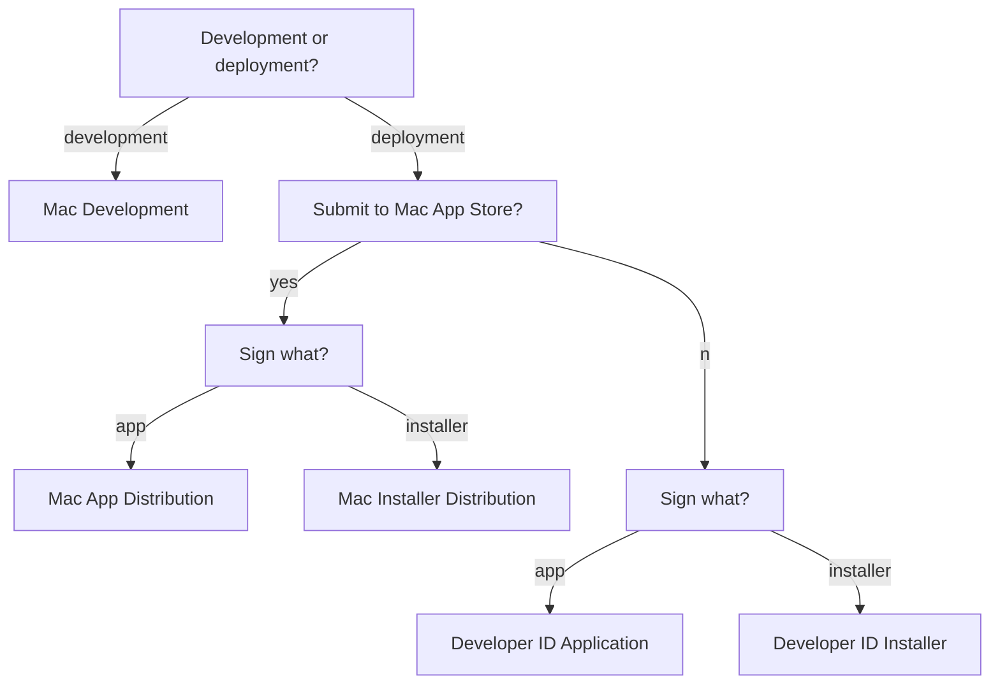

With the public release of macOS 10.14.5, all developers creating a Developer ID certificate for the first time are required to notarize their apps.

<!--more-->

<i class="fa fa-external-link" aria-hidden="true"></i> [New Notarization Requirements](https://developer.apple.com/news/?id=04102019a)

---

### What is notarization?

The Apple notary service is an automated system that scans software for malicious content. 

<i class="fa fa-external-link" aria-hidden="true"></i> [Notarizing Your App Before Distribution](https://developer.apple.com/documentation/security/notarizing_your_app_before_distribution?language=objc)

### Why do we need notarization?

Prior to notarization, [Gatekeeper](https://support.apple.com/en-us/HT202491) checked the source of a downloaded app (either the App Store, a registered developer, or an unidentified developer) and acted as a bouncer to allow or reject their execution. By default, security and privacy preferences are set to allow apps from the App Store and identified developers only. This setting can be further tightened to allow apps downloaded from the App Store only.

macOS 10.12 Sierra removed the option to allow apps from an unidentified developer (signed with a Mac Development certificate, which is available with a free Apple Developer ID for testing, or not signed at all).  As of 10.14.5, this change can be overridden with the following code: ``sudo spctl --master-disable``. Of course, a more prudent way to manage such apps would be to let Gatekeeper report them first and grant permission on a case-by-case basis.
{:.info}

Gatekeeper verifies the signature and identify of an app's developer to ensure that it hasn’t been tampered with or altered. But what if the original app was already designed to engage in shady business? Developers are invited to have their app notarized by Apple, in order to give their users the assurance that the app has passed a security check by Apple before distribution. When an app is notarized, the line "**Apple checked it for malicious software and none was detected**" is added to the Gatekeeper dialog message. 

### What notarization means to apps built with 4D

It seems that in most parts of the world, 4D developers have a very good business relation with their end user. Customers trust them to install and configure their unsigned app, regardless of Gatekeeper settings. Notarization, or code signature for that matter, is less important as a security measure where such level of trust already exists. That said, a 4D developer may still consider signing and notarizing their app, for several reasons:

1. access to certain app services (automation, photo contacts, calendar, notes, etc.) may be restricted for unsigned apps
1. deployment without any human interaction may be required to expand business opportunities
1. Apple may make it mandatory to sign and notarize apps in the future

---

### Prerequisites for notarization
 
- ``Xcode``: ``10`` or later (launch once, or run ``xcode-select --install`` to install command line tools)
- ``macOS``: ``10.13.6`` or later, better to use ``10.4`` to avoid [stapler issues](https://developer.apple.com/documentation/security/notarizing_your_app_before_distribution/resolving_common_notarization_issues?language=objc#3087731)
- ``Entitlement``: **Hardened Runtime** capability
- ``Certificate``: **Developer ID Application** and **Developer ID Installer**
- Code Signature: all executables must be signed *
- Internet Connection: required, to include a secure timestamp with the signature
- SDK: 10.9 or later ** 

**\*** Executables include frameworks, plugins, helpers and tools invoked via ``LAUNCH EXTERNAL PROCESS``.

**\*\*** This does not necessarily mean that the app can't run on macOS 10.8 or earlier. It just means that a newer version of ``codesign`` must be used to sign the app.

<i class="fa fa-external-link" aria-hidden="true"></i>[Notarizing Your App Before Distribution](https://developer.apple.com/documentation/security/notarizing_your_app_before_distribution?language=objc)

### Grant the appropriate entitlements 

An app must have the right set of **entitlements** in order to take advantage of certain services. Some entitlements are embedded with the signature. Other entitlements are associated with the App ID and embedded in its provisioning profile. The "Hardened Runtime" [entitlement](https://developer.apple.com/documentation/bundleresources/entitlements?language=objc) required for notarization falls into the former category.

There are several kinds of entitlements that control the **Hardened Runtime** capability.

<i class="fa fa-external-link" aria-hidden="true"></i>[Hardened Runtime Entitlements](https://developer.apple.com/documentation/security/hardened_runtime_entitlements?language=objc)

* **Allow Execution of JIT-compiled Code Entitlement**: No information available for 4D apps. 
* **Allow Unsigned Executable Memory Entitlement**: No information available for 4D apps. 
* **Allow DYLD Environment Variables Entitlement**: Probably not necessary for 4D apps.
* **Disable Library Validation Entitlement**: Normally, an app built using Xcode has the ``com.apple.security.get-task-allow`` entitlement during development, to facilitate debugging by circumventing certain security checks. Xcode automatically removes this entitlement for deployment during the export phase. This is already done for the 4D app itself. Plugins, on the other hand, might need the ``com.apple.security.get-task-allow`` entitlement in order to be debugged in the context of a host executable. To allow this, you need to enable the ``com.apple.security.cs.disable-library-validation`` entitlement (you enable it to disable the protection).
* **Disable Executable Memory Protection Entitlement**: No information available for 4D apps. 
* **Debugging Tool Entitlement**: Probably not necessary for 4D apps.
* **Location Entitlement**: There are no native 4D commands to access location services, but you may need this if you use plugins that do.
* **Photos Library Entitlement**: There are no native 4D commands to access photos, but you may need this if you use plugins that do.
* **Audio Input Entitlement**: There are no native 4D commands to record audio, but you may need this if you use plugins that do.
* **Camera Entitlement**: There are no native 4D commands to record video, but you may need this if you use plugins that do.
* **Address Book Entitlement**: There are no native 4D commands to access contacts, but you may need this if you use plugins that do.
* **Calendars Entitlement**: There are no native 4D commands to access calendars, but you may need this if you use plugins that do.
* **Apple Events Entitlement**: If the app runs AppleScript via ``osascript``, this entitlement should not be necessary, but you may need this if [ScriptingBridge](https://developer.apple.com/documentation/scriptingbridge?language=objc) or [NSAppleScript](https://developer.apple.com/documentation/foundation/nsapplescript?language=objc) is used by a plugin.

You should grant the least number of entitlements for your 4D app to operate. Imagine, for example, a malicious user who installs an unauthorised plugin that exploits the user's trust in your app and attempts to access sensitive information. Notarization is designed to prevent such abuse.
{:.info}

### Find an appropriate certificate

Certificates are used to sign an application. Certificates can be created <i class="fa fa-external-link" aria-hidden="true"></i>[online](https://developer.apple.com/account), or from <i class="fa fa-external-link" aria-hidden="true"></i>[Xcode](https://help.apple.com/xcode/mac/current/#/dev154b28f09).

Apple recommends <i class="fa fa-external-link" aria-hidden="true"></i>[automatic signing](https://help.apple.com/xcode/mac/current/#/dev80cc24546) by Xcode. For an app built with 4D, most of the work must be performed manually, that is, using command line tools.

For instance, we can use Xcode to <i class="fa fa-external-link" aria-hidden="true"></i>[create a certificate](https://help.apple.com/xcode/mac/current/#/dev154b28f09?sub=dev23755c6c6), but we need to specify the appropriate type of certificate to create.

Apart from **iOS Development** and **iOS Distribution** which are obviously not for 4D, there are 5 different certificates types to choose from:

- Mac Development (Mac Developer)
- Mac App Distribution (3rd Party Mac Developer Application)
- Mac Installer Distribution (3rd Party Mac Developer Installer)
- Developer ID Application
- Developer ID Installer

A new **Apple Development** certificate is available in Xcode 11.0 and later, replacing **iOS Development** and **Mac Development**. Likewise, **Apple Distribution** corresponds to **iOS Distribution** and **Mac App Distribution**.
{:.info}

**Mac Development** is a certificate used during development, to sign an app that needs permission to use an app service or technology. 4D does not use any of the [advanced app capabilities](https://developer.apple.com/support/app-capabilities/) offered by Apple, but notarization checks for the [entitlements](https://developer.apple.com/documentation/bundleresources/entitlements?language=objc) related to the **Hardened Runtime** capability. A 4D app may be signed using this type of certificate for testing.

**Mac App Distribution** is a certificate used to sign the app before distribution through the Mac App Store. Most 4D apps are not distributed through the store, so we can rule this one out.

**Mac Installer Distribution** is a certificate used to sign an installer package containing an app sign using a **Mac App Distribution** certificate, for distribution through the Mac App Store. Most 4D apps are not distributed through the store, so we can rule this one out too.

**Developer ID Application** is a certificate used to sign the app before distribution outside the Mac App Store. A 4D app may be signed using this type of certificate for deployment.

**Developer ID Installer** is a certificate used to sign an installer containing an app sign using a "Developer ID Application" certificate. The installer is either a disk image (.dmg) or a package (.pkg). A simple zip archive is not considered to be a safe form of distribution, since its content can be altered during transport. A signed 4D app may be packaged and signed using this type of certificate for deployment over a network (AirDrop, HTTP, FTP, etc.). Copying an app from a connected external drive does not require an installer.



The nature of a certificate can be deducted from its name. "Distribution" implies distribution through the Mac App Store. "Developer ID" implies distribution outside the Mac App Store. A separate certificate is used for the app and its installer. A "Development" certificate is only used for testing.
{:.info}

---

### The command line workflow

Notarization is integrated in Xcode. When an app is built with 4D, notarization is done using command line tools.

- Build the app 

```
BUILD APPLICATION
```

- Remove extended attributes (optional)

```
xattr -cr .
```

Don't recursively clear extended attributes after signing objects, such action will invalidate existing signatures. 
{:.info}

- Remove old signatures (optional)

```
codesign --remove-signature
```

- Modify ``Info.plist`` as necessary

```
DOM EXPORT TO FILE
```

```
plutil -convert xml1 
```

The XML exported from 4D is not suitable for ``Info.plist`` or ``entitlements.plist``. You must use ``plutil`` to convert the file. 
{:.info}

- Sign native components, plugins, etc. from the inside out

```
codesign --verbose --timestamp --deep --sign {identity_app}
```

- Sign apps

```
codesign --verbose --timestamp --deep --options=runtime --entitlements entitlements.plist --sign {identity_app}
```

Don't use the ``--force`` option indiscriminately. You might invalidate your signature hierarchy. Rather, you should sign objects from the inside out. Naturally, inner objects should be cleaned beforehand, since ``codesign`` will not replace old signatures by default. 
{:.info}

- Create a ZIP archive 

```
ditto -c -k --keepParent sample.app sample.zip
```

or a disk image (UDIF format)

```
hdiutil create -format UDBZ -srcfolder sample.app sample.dmg
```

or a signed flat installer package

```
pkgbuild --component /Applications/sample.app --sign  --sign {identity_installer} /Users/miyako/Desktop/sample.pkg
```

- Uploade the archice, disk image or signed flat package 

```
xcrun altool --notarize-app --file sample.dmg --primary-bundle-id {upload_id} --username user --password pass
```

- Check notarization status 

```
xcrun altool --notarization-info --username user --password pass
```

Keep in mind that notarization is an automated process. Just because an app is accepted doesn't meant that it can be executed. In fact, it is actually quite easy to notarize a 4D app, but the app might crash immediately. It is therefore important to launch the app after notarization.

### Gotchas

**4D Helper** is an app placed inside WebViewerCEF.bundle. As a framework, the bundle needs to be signed with the ``--deep`` option. If the ``--force`` option is used, the signature for 4D Helper will become invalid. On the other hand, if 4D Helper is signed after WebViewerCEF.bundle, that will invalidate the framework's signature. The solution is to avoid the ``--force`` option and sign from the inside out. 4D helper must be signed with hardened runtime. If sufficient entitlements are not granted, the embedded CEF web area will not work.

Likewise, if the app is signed with the ``--deep`` ``--force`` option, all the specific signatures for native components, plugins and tools will become invalid (notarization may succeed, but 4D will crash).

**4D Internet Commands** is a plugin preinstalled in with 4D. With v17.2, the SDK used to build the plugin is older than 10.9, the minimum required for notarization. To solve this, you can remove the plugin from inside the app, or migrate to a newer version altogether (4D 17 R5, for example).

In addition to the main executable, 2 helpers, **HelperTool** and **InstallTool** are also present in the MacOS folder. These  need to be explicitly signed with hardened runtime entitlements.

**Note**: As of 17R5, it seems the helpers have been replaced by a new **InstallTool** app.

As mentioned above, the XML exported from ``DOM EXPORT TO FILE`` is not a usable property list. It must be converted with ``plutil``. You can confirm that the original property list is corrupt, by running ``codesign -d --entitlements -`` to review the embedded entitlements. 

<i class="fa fa-external-link" aria-hidden="true"></i>[Resolving Common Notarization Issues](https://developer.apple.com/documentation/security/notarizing_your_app_before_distribution/resolving_common_notarization_issues?language=objc) 

**Symbolic links** are useful to reference common resources shared across apps and libraries. According to [Gatekeeper Changes in macOS 10.11 and Later](https://developer.apple.com/library/archive/technotes/tn2206/_index.html), symbolic links that "point outside the app bundle" are rejected. If a nested app needs to link to a library or framework outside its bundle, it might be necessary to use ``install_name_tool -change`` and locate the resource, instead of using a symbolic link inside its own "Frameworks" folder.

---

### Managing multiple versions of Xcode 

Unlike ``stapler``, ``altool`` is a command line developer tool installed inside Xcode, invoked via ``xcrun``.

It is quite common for a 4D developer to maintain multiple copies of Xcode on their development Mac. For instance, I keep ``9.4.1`` for 32-bit support. 

We could call ``xcode-select --switch`` (apparently used by 4D for iOS) to specify the location of the active developer directory, but there are some downsides to this approach. First, it would require ``sudo`` superuser permissions. Second, the change would persist beyond the current session.

Perhaps a more insular solution, to use the ``DEVELOPER_DIR`` environment variable is preferable. We could store the string in ``Storage``.

---

<i class="fa fa-external-link" aria-hidden="true"></i>[4d-utility-build-application](https://github.com/miyako/4d-utility-build-application) 
