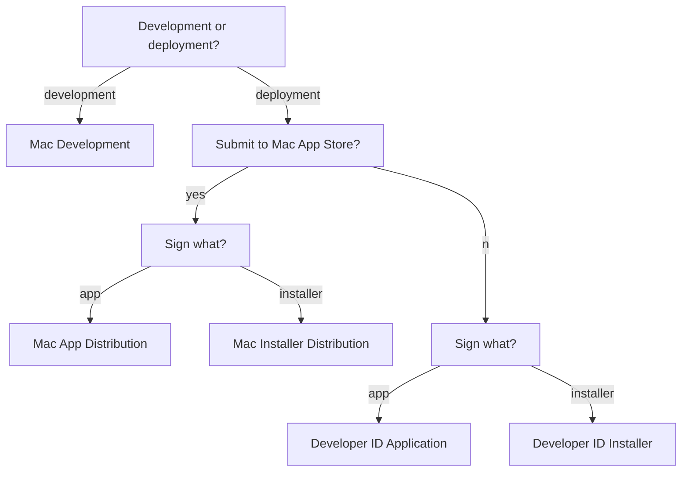

With the public release of macOS 10.14.5, all developers creating a Developer ID certificate for the first time are required to notarize their apps.

<!--more-->

<i class="fa fa-external-link" aria-hidden="true"></i> [New Notarization Requirements](https://developer.apple.com/news/?id=04102019a)

---

### What is notarization?

The Apple notary service is an automated system that scans software for malicious content. 

<i class="fa fa-external-link" aria-hidden="true"></i> [Notarizing Your App Before Distribution](https://developer.apple.com/documentation/security/notarizing_your_app_before_distribution?language=objc)

### Why do we need notarization?

Prior to notarization, [Gatekeeper](https://support.apple.com/en-us/HT202491) checked the source of a downloaded app (either the App Store, a registered developer, or an unidentified developer) and acted as a bouncer to allow or reject their execution. By default, security and privacy preferences are set to allow apps from the App Store and identified developers only. This setting can be further tightened to allow apps downloaded from the App Store only.

macOS 10.12 Sierra removed the option to allow apps from an unidentified developer (signed with a Mac Development certificate, which is available with a free Apple Developer ID for testing, or not signed at all).  As of 10.14.5, this change can be overridden with the following code: ``sudo spctl --master-disable``. Of course, a more prudent way to manage such apps would be to let Gatekeeper report them first and grant permission on a case-by-case basis.
{:.info}

Gatekeeper verifies the signature and identify of an app's developer to ensure that it hasn’t been tampered with or altered. But what if the original app was already designed to engage in shady business? Developers are invited to have their app notarized by Apple, in order to give their users the assurance that the app has passed a security check by Apple before distribution. When an app is notarized, the line "**Apple checked it for malicious software and none was detected**" is added to the Gatekeeper dialog message. 

### What notarization means to apps built with 4D

It seems that in most parts of the world, 4D developers have a very good business relation with their end user. Customers trust them to install and configure their unsigned app, regardless of Gatekeeper settings. Notarization, or code signature for that matter, is less important as a security measure where such level of trust already exists. That said, a 4D developer may still consider signing and notarizing their app, for several reasons:

1. access to certain app services (automation, photo contacts, calendar, notes, etc.) may be restricted for unsigned apps
1. deployment without any human interaction may be required to expand business opportunities
1. Apple may make it mandatory to sign and notarize apps in the future

---

### Prerequisites for notarization
 
- ``Xcode``: ``10`` or later (launch once, or run ``xcode-select --install`` to install command line tools)
- ``macOS``: ``10.13.6`` or later, better to use ``10.4`` to avoid [stapler issues](https://developer.apple.com/documentation/security/notarizing_your_app_before_distribution/resolving_common_notarization_issues?language=objc#3087731)
- ``Entitlement``: **Hardened Runtime** capability
- ``Certificate``: **Developer ID Application** and **Developer ID Installer**
- Code Signature: all executables must be signed *
- Internet Connection: required, to include a secure timestamp with the signature
- SDK: 10.9 or later ** 

**\*** Executables include framework, plugin, PHP, JavaScript, HTML, JSON files, as well as tools invoked via ``LAUNCH EXTERNAL PROCESS``.

**\*\*** This does not necessarily mean that the app can't run on macOS 10.8 or earlier. It just means that a newer version of ``codesign`` must be used to sign the app.

<i class="fa fa-external-link" aria-hidden="true"></i>[Notarizing Your App Before Distribution](https://developer.apple.com/documentation/security/notarizing_your_app_before_distribution?language=objc)

### Grant the appropriate entitlements 

An app must have the right set of **entitlements** in order to take advantage of certain services. Some entitlements are embedded with the signature. Other entitlements are associated with the App ID and embedded in its provisioning profile. The "Hardened Runtime" [entitlement](https://developer.apple.com/documentation/bundleresources/entitlements?language=objc) required for notarization falls into the former category.

There are several kinds of entitlements that control the **Hardened Runtime** capability.

<i class="fa fa-external-link" aria-hidden="true"></i>[Hardened Runtime Entitlements](https://developer.apple.com/documentation/security/hardened_runtime_entitlements?language=objc)

* **Allow Execution of JIT-compiled Code Entitlement**: No information available for 4D apps. 
* **Allow Unsigned Executable Memory Entitlement**: No information available for 4D apps. 
* **Allow DYLD Environment Variables Entitlement**: Probably not necessary for 4D apps.
* **Disable Library Validation Entitlement**: Normally, an app built using Xcode has the ``com.apple.security.get-task-allow`` entitlement during development, to facilitate debugging by circumventing certain security checks. Xcode automatically removes this entitlement for deployment during the export phase. This is already done for the 4D app itself. Plugins, on the other hand, might need the ``com.apple.security.get-task-allow`` entitlement in order to be debugged in the context of a host executable. To allow this, you need to enable the ``com.apple.security.cs.disable-library-validation`` entitlement (you enable it to disable the protection).
* **Disable Executable Memory Protection Entitlement**: No information available for 4D apps. 
* **Debugging Tool Entitlement**: Probably not necessary for 4D apps.
* **Location Entitlement**: There are no native 4D commands to access location services, but you may need this if you use plugins that do.
* **Photos Library Entitlement**: There are no native 4D commands to access photos, but you may need this if you use plugins that do.
* **Audio Input Entitlement**: There are no native 4D commands to record audio, but you may need this if you use plugins that do.
* **Camera Entitlement**: There are no native 4D commands to record video, but you may need this if you use plugins that do.
* **Address Book Entitlement**: There are no native 4D commands to access contacts, but you may need this if you use plugins that do.
* **Calendars Entitlement**: There are no native 4D commands to access calendars, but you may need this if you use plugins that do.
* **Apple Events Entitlement**: If the app runs AppleScript via ``osascript``, this entitlement should not be necessary, but you may need this if [ScriptingBridge](https://developer.apple.com/documentation/scriptingbridge?language=objc) or [NSAppleScript](https://developer.apple.com/documentation/foundation/nsapplescript?language=objc) is used by a plugin.

You should grant the least number of entitlements for your 4D app to operate. Imagine, for example, a malicious user who installs an unauthorised plugin that exploits the user's trust in your app and attempts to access sensitive information. Notarization is designed to prevent such abuse.
{:.info}

### Find an appropriate certificate

Certificates are used to sign an application. Certificates can be created <i class="fa fa-external-link" aria-hidden="true"></i>[online](https://developer.apple.com/account), or from <i class="fa fa-external-link" aria-hidden="true"></i>[Xcode](https://help.apple.com/xcode/mac/current/#/dev154b28f09).

Apple recommends <i class="fa fa-external-link" aria-hidden="true"></i>[automatic signing](https://help.apple.com/xcode/mac/current/#/dev80cc24546) by Xcode. For an app built with 4D, most of the work must be performed manually, that is, using command line tools.

For instance, we can use Xcode to <i class="fa fa-external-link" aria-hidden="true"></i>[create a certificate](https://help.apple.com/xcode/mac/current/#/dev154b28f09?sub=dev23755c6c6), but we need to specify the appropriate type of certificate to create.

Apart from **iOS Development** and **iOS Distribution** which are obviously not for 4D, there are 5 different certificates types to choose from:

- Mac Development (Mac Developer)
- Mac App Distribution (3rd Party Mac Developer Application)
- Mac Installer Distribution (3rd Party Mac Developer Installer)
- Developer ID Application
- Developer ID Installer

A new **Apple Development** certificate is available in Xcode 11.0 and later, replacing **iOS Development** and **Mac Development**. Likewise, **Apple Distribution** corresponds to **iOS Distribution** and **Mac App Distribution**.
{:.info}

**Mac Development** is a certificate used during development, to sign an app that needs permission to use an app service or technology. 4D does not use any of the [advanced app capabilities](https://developer.apple.com/support/app-capabilities/) offered by Apple, but notarization checks for the [entitlements](https://developer.apple.com/documentation/bundleresources/entitlements?language=objc) related to the **Hardened Runtime** capability. A 4D app may be signed using this type of certificate for testing.

**Mac App Distribution** is a certificate used to sign the app before distribution through the Mac App Store. Most 4D apps are not distributed through the store, so we can rule this one out.

**Mac Installer Distribution** is a certificate used to sign an installer package containing an app sign using a **Mac App Distribution** certificate, for distribution through the Mac App Store. Most 4D apps are not distributed through the store, so we can rule this one out too.

**Developer ID Application** is a certificate used to sign the app before distribution outside the Mac App Store. A 4D app may be signed using this type of certificate for deployment.

**Developer ID Installer** is a certificate used to sign an installer containing an app sign using a "Developer ID Application" certificate. The installer is either a disk image (.dmg) or a package (.pkg). A simple zip archive is not considered to be a safe form of distribution, since its content can be altered during transport. A signed 4D app may be packaged and signed using this type of certificate for deployment over a network (AirDrop, HTTP, FTP, etc.). Copying an app from a connected external drive does not require an installer.



The nature of a certificate can be deducted from its name. "Distribution" implies distribution through the Mac App Store. "Developer ID" implies distribution outside the Mac App Store. A separate certificate is used for the app and its installer. A "Development" certificate is only used for testing.
{:.info}

---

### The command line workflow

Notarization is integrated in Xcode. When an app is built with 4D, notarization is done using command line tools.

- Build the app 

```
BUILD APPLICATION
```

- Remove extended attributes

```
xattr -cr .
```

- Sign the app

```
codesign --verbose --deep --force --options=runtime --timestamp --entitlements entitlements.plist --sign {identity_app}
```

- Create a ZIP archive 

```
ditto -c -k --keepParent  sample.app sample.zip
```

or a disk image (UDIF format)

```
hdiutil create -srcfolder sample.app sample.dmg
```

or a signed flat installer package

```
pkgbuild --component /Applications/sample.app --sign  --sign {identity_installer} /Users/miyako/Desktop/sample.pkg
```

---

### Case study: Notarize v17.2

#### Step 1 

Let's use a clean install version of v17.2 and see what happens.

No entitlements, no hardened runtime, just normal ``codesign --deep --force --sign``.

``altool`` returns the following exceptions:

**The executable does not have the hardened runtime enabled** (5)  

* 4D.app/Contents/MacOS/HelperTool
* 4D.app/Contents/MacOS/4D
* 4D.app/Contents/MacOS/InstallTool
* 4D.app/Contents/Resources/php/Mac/php-fcgi-4d
* 4D.app/Contents/Native Components/WebViewerCEF.bundle/Contents/Frameworks/4D Helper.app/Contents/MacOS/4D Helper

**The binary is not signed** (6)  

* 4D.app/Contents/Plugins/4D InternetCommands.bundle/Contents/MacOS/4D InternetCommands (3)
* 4D.app/Contents/Native Components/WebViewerCEF.bundle/Contents/Frameworks/4D Helper.app/Contents/MacOS/4D Helper
* 4D.app/Contents/Native Components/WebViewerCEF.bundle/Contents/Frameworks/Chromium Embedded Framework.framework/Chromium Embedded Framework
* 4D.app/Contents/SASL Plugins/libdigestmd5.plugin

**The signature does not include a secure timestamp** (6)

* 4D.app/Contents/Plugins/4D InternetCommands.bundle/Contents/MacOS/4D InternetCommands (3)
* 4D.app/Contents/Native Components/WebViewerCEF.bundle/Contents/Frameworks/4D Helper.app/Contents/MacOS/4D Helper
* 4D.app/Contents/Native Components/WebViewerCEF.bundle/Contents/Frameworks/Chromium Embedded Framework.framework/Chromium Embedded Framework
* 4D.app/Contents/SASL Plugins/libdigestmd5.plugin

**4D Internet Commands** has 3 architectures (i386, x84_64, x64_64h).
{:.info}

**The signature algorithm used is too weak** (1)

* 4D.app/Contents/Resources/php/Mac/php-fcgi-4d

`fail`{:.error}

#### Step 2

Let's just sign all **plugins**, all **native components**, **PHP** and the **SASL plugin** with the ``--timestamp`` option. This should al least take care of the "not signed", "does not include timestamp" and "signature algorithm is too weak" issues. 

Other than the "hardened runtime" exception, ``altool``now  returns the following exceptions:

**The signature of the binary is invalid** (2)  

* 4D.dmg/4D.app/Contents/Plugins/4D InternetCommands.bundle/Contents/MacOS/4D InternetCommands (2)

**The binary uses an SDK older than the 10.9 SDK** (2)

* 4D.dmg/4D.app/Contents/Plugins/4D InternetCommands.bundle/Contents/MacOS/4D InternetCommands (2)

`fail`{:.error}

#### Step 3 

We could replace **4D Internet Commands** with a newer copy (17R5, for example). Since not all application need this legacy plugin, and a plugin can always be installed at the structure level, we could alternatively remove it from the app.

Either way, the "invalid signature" issues are gone, but we still have the "hardened runtime" issues.

`fail`{:.error}

#### Step 4

Let's sign **PHP**, **4D Helper** and the app itself with ``--entitlements`` and ``--options=runtime``.

We no longer have critical validation errors, in fact, the app is accepted and notarized by Apple...but wait! **Can we actually launch it**?

When a notarized version of 4D is launched, we systematically get the following error:

```
0   ???                           	0x000000011a93e000 0 + 4740866048
1   com.4d.4d                     	0x000000010241ff3b CallAsmPart2 + 65
2   ???                           	0x000070000dc9b280 0 + 123145533633152
3   com.4d.4d                     	0x00000001020490ab VDBLanguageContext_compiled::DoExecute(calcblock&, VCodeDescriptor*) + 179
4   com.4d.4d                     	0x0000000102058d98 VDBLanguageContext::Execute(VDB4DTableProxy*, VFormContext*, short, int, int, champvar_template<256>**, VCodeDescriptor*) + 160
5   com.4d.4d                     	0x0000000101fd25f6 V4DDatabase::ExecuteScript(VFormObject*, VScriptRef*, int, int*) + 142
6   com.4d.4d                     	0x00000001020c989a VFormObject::ExecuteScript(int, int, int*) + 126
7   com.4d.4d                     	0x000000010207d110 VFormContext::ExecuteCycle(int) + 324
8   com.4d.4d                     	0x0000000101d81c77 saisierec::_Open(bool) + 1581
9   com.4d.4d                     	0x0000000101d815d9 saisierec::Open(bool) + 69
10  com.4d.4d                     	0x0000000101dd4927 NewDial4DStrWithTitle(xbox::VString const&, xbox::VString const&, Rect*, short, short, unsigned int, V4DWindowPlacement const*, Dial4DRec*, unsigned char, WindowLevel) + 2169
11  com.4d.4d                     	0x0000000101dd4ce6 NewDial4Dstr(xbox::VString const&, Rect*, short, short, unsigned int, Dial4DRec*, unsigned char, V4DWindowPlacement const*, WindowLevel) + 50
12  com.4d.4d                     	0x000000010227a5b4 V4DDialog::_Show(xbox::VWindow const&, xbox::VWindow const&, short, short, WindowLevel, unsigned int, xbox::VRect const&, V4DWindowPlacement const*) + 236
13  com.4d.4d                     	0x000000010227a49f V4DDialog::Show(V4DDialog::WindowKind, xbox::VWindow const&, unsigned int, xbox::VRect const&, V4DWindowPlacement const*, WindowLevel) + 221
14  com.4d.4d                     	0x000000010227a341 V4DDialog::Show(V4DDialog::WindowKind, xbox::VWindow const&, unsigned int, xbox::VRect const&) + 23
15  com.4d.4d                     	0x00000001022854b7 V4DFloatingToolbar::CreateDialog() + 297
16  com.4d.4d                     	0x000000010228bac2 V4DControllerTask::_RunWithoutDatabase() + 28
17  com.4d.4d                     	0x000000010228b161 V4DControllerTask::_Run(V4DTaskConcrete*) + 183
18  com.4d.4d                     	0x000000010228afe6 V4DControllerTask::_RunProc(V4DTaskConcrete*, xbox::IRefCountable*) + 64
19  com.4d.4d                     	0x0000000101fe0da0 Task4DProc(V4DTaskConcrete*) + 957
20  com.4d.4d                     	0x000000010245ebe2 V4DTaskManager::_Task4DProc(xbox::VTask*) + 158
21  com.4d.kernel                 	0x000000010428592d xbox::VTask::_Run() + 141
22  com.4d.kernel                 	0x000000010428b2f6 xbox::XMacTask_fiber::_ThreadProc(void*) + 70
23  com.4d.kernel                 	0x00000001042c04cf xbox::VMacFiber_thread::_ThreadProc(void*) + 31
24  com.apple.CoreServices.CarbonCore	0x00007fff303ffea4 CooperativeThread + 282
25  libsystem_pthread.dylib       	0x00007fff5b1ed2eb _pthread_body + 126
26  libsystem_pthread.dylib       	0x00007fff5b1f0249 _pthread_start + 66
27  libsystem_pthread.dylib       	0x00007fff5b1ec40d thread_start + 13
```

 `fail`{:.error}
 
<i class="fa fa-external-link" aria-hidden="true"></i>[Resolving Common Notarization Issues](https://developer.apple.com/documentation/security/notarizing_your_app_before_distribution/resolving_common_notarization_issues?language=objc) 

---

### Managing multiple versions of Xcode 

Unlike ``stapler``, ``altool`` is a command line developer tool installed inside Xcode, invoked via ``xcrun``.

It is quite common for a 4D developer to maintain multiple copies of Xcode on their development Mac. For instance, I keep ``9.4.1`` for 32-bit support. 

We could call ``xcode-select --switch`` (apparently used by 4D for iOS) to specify the location of the active developer directory, but there are some downsides to this approach. First, it would require ``sudo`` superuser permissions. Second, the change would persist beyond the current session.

Perhaps a more insular solution, to use the ``DEVELOPER_DIR`` environment variable is preferable. We could store the string in ``Storage``.
